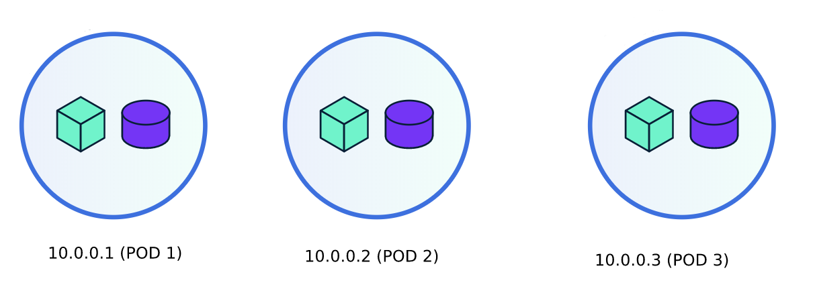

## סדנה בתקשורת מחשבים 20588


## Objective
Java program called "synchonizer" responsible for synchronizing path file data  
between multiple computers.

## Prerequesites
 * JDK 1.8 
 * Docker (optional)
    
### Principles
 * EventBus Actions
    *
    *
    *
 * SharedData 
    * local.path
    * global.path
 * Events
    * localChangeDetected
    * remoteChangeDetected
    * StateChanged
    * ConfigSaved
    * DownloadProgress
    * FolderSummary
    * FolderWatchStateChanged
    * FolderScanProgress
    * DeviceDiscovered
    * DeviceConnected
    * DeviceDisconnected
    * DeviceRejected
    * DevicePaused
    * DeviceResumed
    
 * Service
    * tcpDial
    * tcpListen
    
 * Verification
    * add computer with Unique ID and IP
    
    
### Design/Functionality
 * Multi Threaded Server
    * Storage Application
        * local directory listener
        * chunk files (for upload)
        * rename files
        * modify file content
        * delete files
        * compress chunks
        * delta comparisons
    * P2P application 
        * upload files
        * download files
        * listen to actions
        * transmit actions

## Adding computers to the network
* each computer has a unique ID. To add computers someone from 
the network will need to add the unique ID and establish a connection.

## Discovery Protocol
Local discovery protocol

### Dependencies
* [vertex](https://vertx.io)
* [apache commons-net]()
* [apache commons-io]()
* [apache-commons-cli]()

### How to install
1) mvn install
2) run .jar
### Imitating isolated hosts docker containers (each pod runs a container of "synchronizer")


## When to use verticles and when to use threads?
## verticles vs Threads
## Task vs Service

## Action vs Message
Action represent modification type like rename,create or delete action.
Message on the other side contains file raw data (deltas).
Ack/Nack are action type representing acknowledgement of a message - validated acceptance 
of file data.

## Round Robin Algorithm

### Implementation Guide:

## scatter-gather protocol
##### MultiThreadedApplication
   - Initialize an application:
      ``` java
      class Application extends MultiThreadedApplication{
        @Override
        public void kill(){}
      }
      
      class Program{
        public void main(String [] args){
            Application app = new Application();
        }
      } 
      ```
   - Add new stachostic task (executed asynchronically) to application:
      ``` java
        app.scheduleStachosticTask(new Task(){
            @Override
            public void run(){
                System.out.println("storage applicaiton runs stachostic task!");
            }
        });
        ```
   - Add new sequent task (executed synchronically) to application:
        ``` java
         app.scheduleSequentTask(new Task() {
            @Override
            public void run() {
                System.out.println("storage application executed sequent task #1");
            }
         });
         app.scheduleSequentTask(new Task() {
             @Override
             public void run() {
                System.out.println("storage application executed sequent task #2");
             }
         });
        ```
        
##### StorageApplication

* __Scan periodically file system__
```java
    // scan local file system path structure every 10 seconds.
    vertx.setPeriodic(10000,v->{
        vertx.deployVerticle(new LocalFileSystemWalkerVerticle(path));
    });
```
* __Consume EventBus messages__
```java
 // consume path map
 vertx.deployVerticle(new Verticle() {
     @Override
     public Vertx getVertx() {
         return null;
     }

     @Override
     public void init(Vertx vertx, Context context) {

     }

     @Override
     public void start(Future<Void> startFuture) throws Exception {
         EventBus eb = vertx.eventBus();
         eb.consumer("files", message ->{
             logger.info(message.body());
         });
     }

     @Override
     public void stop(Future<Void> stopFuture) throws Exception {
     }
 });
* __Pubblish EventBus messages__

```
##### P2PApplication
* Add TCP peer to the network
```java
    // add peer on host 10.0.0.5 and listening port 2017
    vertx.deployVerticle(new TCPPeer("10.0.0.5",2017));

```
* Consume EventBust action messages
```java


```


        
        
#### Demo Time!

1) Create docker network
```bash
# class B subnet, broadcast 172.18.255.255
docker network create --subnet=172.18.0.0/16 mynet123
```
2) Pre-Define peers IP addresses and ports
```bash
172.18.0.10:2020
172.18.0.15:2020
172.18.0.17:2020
172.18.0.20:2020
```

3) Run docker containers with "synchronizer" software

Client 1:
```bash
docker run --net mynet123 --ip 172.18.0.10 -it --rm synchronizer:latest  
```
Client 2:
```bash
docker run --net mynet123 --ip 172.18.0.15 -it --rm synchronizer:latest  
```
Client 3:
```bash
docker run --net mynet123 --ip 172.18.0.17 -it --rm synchronizer:latest  
```
Client 4:
```bash
docker run --net mynet123 --ip 172.18.0.20 -it --rm synchronizer:latest  
```
        
### Makefile
```bash
# build maven project
build:
	@mvn package

# clean java targets (jar and .class files)
clean:
	@mvn clean

# run java target with arguments
run:
	@java -jar target/synchronizer-jar-with-dependencies.jar -p /Users/gabrielmunits/opt/dir -d 172.18.0.10:2020 172.18.0.15:2020

# build docker image
build-docker:
	@docker build . -t synchronizer:latest

# run all docker clients
run-all: run-docker-client-1 run-docker-client-2 run-docker-client-3 run-docker-client-4

# run docker client 1
run-docker-client-1:
	@docker run --net mynet123 --ip 172.18.0.10 -it --rm synchronizer:latest

run-docker-client-2:
	@docker run --net mynet123 --ip 172.18.0.15 -it --rm synchronizer:latest

run-docker-client-3:
	@docker run --net mynet123 --ip 172.18.0.17 -it --rm synchronizer:latest

run-docker-client-4:
	@docker run --net mynet123 --ip 172.18.0.20 -it --rm synchronizer:latest


# kill all docker clients
kill:
	docker stop $(docker ps -q --filter ancestor=<synchronizer:latest> )

```
